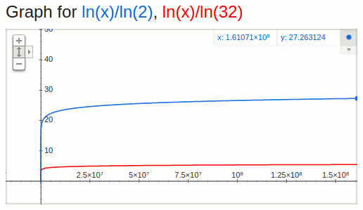

UncleJim ("**Un**modifiable **Coll**ections for **J**ava™ **Imm**utability") is a small library that enables a cleaner, safer style of Java programming.  It approaches a domain specific language (DSL) inside Java.

#Examples
```java
// Define some people with lists of email addresses on the
// fly.  vec() makes a List, tup() makes a Tuple
vec(tup("Jane", "Smith", vec("a@b.c", "b@c.d")),
    tup("Fred", "Tase", vec("c@d.e", "d@e.f", "e@f.g")))

        // Turn that into pairs of emails and people.
        // flatMap() the list of people into a list of
        // emails.  map() the emails to email/person pairs
        // while the person object is still in scope.
        .flatMap(person -> person._3()
                                 .map(mail -> tup(mail,
                                                  person)))

        // toImMap() expects a function that maps items to
        // key/value pairs.  We already have pairs, so pass
        // it the identity function.
        .toImMap(x -> x)

        // Look up Jane by her address
        .get("b@c.d")

        // Get her first name (returns "Jane")
        ._1());
```

Additional examples are implemented as unit tests to ensure that they remain correct and current.

* [Usage examples](src/test/java/org/organicdesign/fp/UsageExampleTest.java#L34) - different ways of improving your Java code with UncleJim.

* [Comparison with Traditional Java and Java 8 Streams](src/test/java/org/organicdesign/fp/TradJavaStreamComparisonTest.java#L22)

* [Class/Interface Hierarchy](inheritanceHierarchy.pdf) (PDF)

* For complete API documentation, please build the javadoc: `mvn javadoc:javadoc`

#Maven Dependency
```xml
<dependency>
        <groupId>org.organicdesign</groupId>
        <artifactId>UncleJim</artifactId>
        <version>0.10.10</version>
</dependency>
```

#Manifesto

* Immutability promotes correct code as much as type safety does.
* Better to focus on picking the appropriate collections and transformations than on looping details.
* Write functions before defining classes, yet still take advantage of type safety.
* On-the fly data definition should be simple and easy.  Naming/formalizing these data structures should be too.

#Features

* Type-safe versions of Clojure's immutable collections, implementing the generic `java.util` collection interfaces.
* A simplified immutable alternative to Java 8 Streams, wrapping checked exceptions and avoiding primitives.
* A tiny, type-safe data definition language of brief helper functions: `vec()`, `set()`, `map()`, and `tup()`, (like Clojure's vector `[]`, set `#{}`, and map `{}`).
* Extend Tuples to make your own immutable Java classes (with correct `equals()`, `hashCode()`, and `toString()` implementations) almost as easily as writing case classes in Scala.

UncleJim takes advantages of Java's type inferencing by avoiding void return types, arrays, primatives, and checked exceptions in lambdas.  It can decrease the amount of code you need to write by a factor of at 2x-3x while focusing you on using the right collections for the fastest possible code.

#Self-Guided Training
[JimTrainer](https://github.com/GlenKPeterson/JimTrainer) contains a few short problem-sets for learning UncleJim 

#FAQ

##Q: How does this compare to PCollections?

[PCollections](http://pcollections.org/) competes only with UncleJim's first bullet point: immutable collections.
Clojure's vector (list) and hashMap/hashSet have O(log<sub>32</sub> *n*) performance, which theoretically scales better than the O(log<sub>2</sub> *n*) binary tree structures it looks like PCollections uses.



This graph shows how many operations each lookup requires (y) for a given number of items in the collection (x).  The red line is the fast log<sub>32</sub>, the blue is the slower log<sub>2</sub>.
Daniel Spiewak explains all the ramifications of this better than I ever could: https://www.youtube.com/watch?v=pNhBQJN44YQ

The Clojure collections also walk the sibling nodes in the internal data trees of these structures to provide iterators, which is pretty cool performance-wise.
PCollections starts from the top of the tree doing an index lookup for each item, then increments the index and goes back to the top to look up the next (at least for the list implementation).

Clojure's (and Java's) sorted/tree map/set implementations are O(log<sub>2</sub> *n*), so PCollections could theoretically be as fast or faster for those two collections.
If someone does performance testing to verify these theories, please let me know so I can link to it here.

UncleJim has additional benefits listed in the bullets at the top of this document.

##Q: Do these Transforms create intermediate collections between each operation (like the Scala collections)?

No.

Xform is a lazy, immutable builder for transformations.
It records the operations you specify without carrying any of them out.
When you call foldLeft() or one of the "endpoint" methods like toImList(), it creates the lightest-weight execution path and performs simplified operations in a for loop with only 3 if statements (some have sub-branches).
On my machine, single-threaded, with 30 million items in an ArrayList source, Xform takes an average of 122ms as opposed to 120ms for the native for loop - better than 98% as fast as the fastest iteration available on the JVM, but with much more functionality.
The heart of the implementation is [_foldLeft() in Xform](src/main/java/org/organicdesign/fp/xform/Xform.java), but it's kind of where "useful and easy to code" meets "fast to execute" and is probably some of the hardest code in the project to read and comprehend.
The Transfom implementation is loosely based on [Paul Philips concept of a "View,"](https://www.youtube.com/watch?v=uiJycy6dFSQ&t=26m19s) not on Clojure's Sequence abstraction.

There is only one exception: a second version of foldLeft() that takes an extra terminateWhen parameter to stop processing based on an output condition instead of an input condition.
I think I've used it once, ever, in a real-world situation (normally you use takeWhile to terminate based on an input condition).
It uses a temporary internal ArrayList to accumulate results for the termination test, then later converts them to whatever output format you specify.

##Q: How does this compare to Streams and lambda expressions in JDK8?

* When you process data with a Java8 stream, you end up with a mutable collection.
You can choose to do that with UncleJim, but it's safer to store your result in an immutable collection.
java.util.Collections can wrap mutable collections in an unmodifiable wrapper, but UncleJim's wrappers also deprecate the mutator methods so that your IDE and compiler warn you if you try to call them.

* If you later add or remove a few items, Unmodifiable collections require an expensive defensive copy of the entire collection.
The Clojure-derived collections in UncleJim only duplicate the tiny area of the collection that was changed
to return a new immutable collection that shares as much data as practical with the old one.
As immutable collections go, they have excellent performance.

* The [java.util.function interfaces](src/test/java/org/organicdesign/fp/TradJavaStreamComparisonTest.java#L258) do nothing to help you with Exceptions.
 [UncleJim wraps checked exceptions in unchecked ones](src/main/java/org/organicdesign/fp/function/Function1.java#L29) for you, so that you can write
 anonymous functions more like you would in Scala.

* For up to 2-argument functions, java.util.function has 43 different interfaces.
The functional methods on these interfaces are named differently, with a total of 11 different names for `apply()`.
UncleJim has 3 equivalent interfaces, named by number of arguments (like Scala).
All have an `applyEx()` that you override and an `apply()` method that callers can use if they want to ignore checked exceptions (they usually do).
If you don't want to return a result, declare the return type as `?` and return `null`.
For example: `Function1<Integer,?>` takes an Integer and the return value is ignored.

* You can't use `Collector` on Java 8 streams with immutable data structures.  Even if you love mutability, Java 8 still has the complexity of accumulator vs. combiner functions and a host of implementations of these.  UncleJim collects to immutable data structures with simple methods like toImList() or toImSet().  Some collection methods require that you pass a comparator and or map items to key/value pairs, but these are still very simple operations.

* I had an enum, `MyEnum` and wanted to pass `MyEnum::values` as a function reference to a Java 8 stream.  The return-type of `MyEnum.values()` is  `Enum<MyEnum>[]`.  An array of a parameterized type.  Between the `Arrays.asList()`, the cast from `MyEnum[]` to `Enum<MyEnum>[]`, the checked exception in the method body - what a nightmare!  In UncleJim, all you need is `vec(MyEnum.values())` and you're in happy functional world.

* If you want to define data in Java 8, you end up learning the difference between Arrays.asList() and Collections.singletonList(), or defining one-off classes for every kind of data you might need before you start writing any code. UncleJim has a tiny data-definition language (like a type-safe JSON) with extensible Tuples to give your data structures meaningful type-safe names with a minimum of code.  With UncleJim, you can define your data first and name it later.  Even that initial definition is checked by the type system.
 
* You can still use non-destructive Java 8 stream methods on immutable (or unmodifiable) collections if you want to.  UncleJim doesn't affect what you do with mutable collections at all (but, eew).

#Change Log
See [changeLog.txt](changeLog.txt)

#Licenses
Java&trade; is a registered trademark of the Oracle Corporation in the US and other countries.
UncleJim is not part of Java.
Oracle is in no way affiliated with the UncleJim project.

UncleJim is not part of Clojure.
Rich Hickey and the Clojure team are in no way affiliated with the UncleJim project, though it borrows heavily from their thoughts and is partly a derivative work of their open-source code.

The Clojure collections are licensed under the Eclipse Public License.
Versions of them have been included in this project and modified to add type safety and implement different interfaces.
These files are still derivative works under the EPL.

Unless otherwise stated, the rest of this work is licensed under the Apache 2.0 license.
New contributions should be made under the Apache 2.0 license whenever practical.
I believe it is more popular, clearer, and has been better tested in courts of law.

#Contributors
You can find build requirements, API highlights, and additional information in: [README2.md](README2.md).
