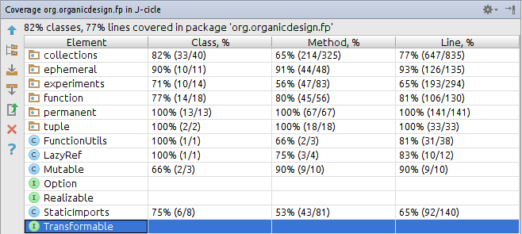

UncleJim ("**Un**modifiable **Coll**ections for **J**ava&trade; **Imm**utability") brings Clojure's immutable collections, a Sequence abstraction, and other Functional Programming benefits to Java.
Fluent interfaces encourage you to write expressions (that evaluate) instead of statements (that produce void).
Immutable collections are fast enough to make it unnecessary to modify data in place.  Unmodifiable wrappers for existing Java collections help you retrofit legacy code.  UncleJim pushes Java toward Clojure, but keeps the type saftey, objects, classes, and C-like syntax that Java programmers are accustomed to.

Migrating large code bases to another language is not always practical.
This project lets you think about your code the way that Clojure and to some degree Scala programmers do, but still write Java.
Java may not have the terseness or regularity of Clojure.
Its type system is not as advanced as Scala's.
But it can still provide many of the best aspects of both these languages if used carefully.
This project encourages that kind of use.

Currently an *** Alpha Release ***.  The API is subject to minor changes, but test coverage was above 85% before adding PersistentHashMap and PersistentHashSet (currently 73%):



For complete API documentation, please build the javadoc:
`mvn javadoc:javadoc`

#Usage
Create an immutable, type safe map:
```java
ImMap<String,Integer> itemMap = PersistentMapSorted.of(
        "One", 1,
        "Two", 2,
        "Three", 3);
```

Create an UnmodifiableMap of 0, 1, 2, or 3 items (no nulls) depending on the values of showFirst, showSecond, and showThird:
```java
ImMap<String,Integer> itemMap = PersistentMapSorted.ofSkipNull(
        showFirst ? Tuple2.of("One", 1) : null,
        showSecond ? Tuple2.of("Two", 2) : null,
        showThird ? Tuple2.of("Three", 3) : null);
```

Similar type-safe methods are available for producing [unmodifiable Sets and Lists of any length](src/main/java/org/organicdesign/fp/StaticImports.java#L180)
(unMaps currently go from 0 to 10 type-safe keys and values, or an infinite number of Map.Entries/Tuple2s).

Add another item to an immutable map?

```java
itemMap = itemMap.assoc("Four", 4);
```

Transform unmodifiable data into other unmodifiable data, lazily, without processing any more items than necessary (based on this unit test: [SequenceTest.java](src/test/java/org/organicdesign/fp/permanent/SequenceTest.java#L145)):

```java
ImList<Integer> list = Sequence.ofArray(4,5)//       4,5
        .prepend(Sequence.ofArray(1,2,3))   // 1,2,3,4,5
        .append(Sequence.ofArray(6,7,8,9))  // 1,2,3,4,5,6,7,8,9
        .filter(i -> i > 4)                 //         5,6,7,8,9
        .map(i -> i - 2)                    //     3,4,5,6,7
        .take(5)                            //     3,4,5,6
        .drop(2)                            //         5,6
        .toImList();

list.toString(); // Returns: "PersistentVector(4,5,6)"
```
These transformations do not change the underlying data.  They build a new collection by chaining together all the
operations you specify, then lazily applying them in a single pass.  The laziness is
implemented as an incremental pull, so that if your last operation is take(1), then the absolute minimum number of
items will be evaluated through all the functions you specified.  In the example above, items 7, 8, and 9 are never
processed.

#Motivations

The goals of this project are to make it easy to use Java:

 - Immutably (Josh Bloch Item 15)
 - Type safely (Josh Bloch Item 23)
 - Functionally (using first-class functions more easily)
 - Expressiveness/Brevity (Expressions over statements: all API calls evaluate to something useful for subsequent calls).
 - Minimizing the use of primitives and arrays (except for varargs, Suggested by Josh Bloch Items 23, 25, 26, 27, 28, 29)
 - Returning empty collections instead of <code>null</code> (Josh Bloch Item 43)
 - "Throw exceptions at people, not at code" (says Bill Venners, but also Josh Bloch Item 59)
 - Concurrency friendly (Josh Bloch Item 66, 67)
 - Context-sensitive equality: prefer Comparators to <code>equals()</code>, <code>hashcode()</code> and <code>compareTo()</code> ([Daniel Spiewak, Viktor Klang, Rúnar Óli Bjarnason, Hughes Chabot](http://glenpeterson.blogspot.com/2013/09/object-equality-is-context-relative.html), java.util.TreeSet, java.util.TreeMap)
 - Sensible toString() implementations (like Scala)
 - Compatibly with existing/legacy Java code

Higher order functions are not just briefer to write and read, they are less to *think* about.
They are useful abstractions that simplify your code and focus your attention on your goals rather than the details of how to accomplish them.
Function chaining: <code>xs.map(x -> x + 1).filter(x -> x > 7).head()</code> defines what you are doing and how you are doing it in the simplest possible way, hiding all details about how to iterate through the underlying collection.

The alternative - loops - are bundles of unnecessary complexity.
Loops generally require setting up accumulators, then running a gamut of <code>if</code>, <code>break</code>, and <code>continue</code> statements, like some kind of mad obstacle race that involves as many state changes as possible.
Different kinds of collections require different looping constructs - more complexity.
Looping code is vulnerable to "off-by-one" boundary overflow/underflow, improper initialization, accidental exit, infinite loops, forgetting to update a counter, updating the wrong counter...  The list goes on!
None of that has anything to do with why the loop was created in the first place which is to transform the underlying data.

You don't have to write that kind of code any more.
If you want to map one set of values according to a given function, say so with xs.map().
Filter?  xs.filter().
It's clearer, simpler, and like type safety, it eliminates whole classes of errors.

No data is changed when using the permanent transformers in this project.
They allow you to write nearly elegant programs whose function calls chain together and evaluate into a useful result.
Clojure works like this, only the syntax makes the evaluation go inside out from the order you read the statements in (hence Clojure's two arrow operators).
With method chaining, the evaluation happens in the same order as the methods are written on the page, much like piping commands to one another in shell scripts.

Incremental evaluation prevents some items from being evaluated to produce the results you need which is sometimes more efficient than traditional whole-collection transforms.
There may be cases where a well hand-written loop will be faster, but in general, the overhead for using these transformations is minimal and, I believe, well worth the clarity, safety, and productivity benefits they provide.
If you find a better/faster implementation, please submit your improvements!

#API

Functions available in <code>Sequence</code> (as of 2015-03-15):
###Starting Points:
```java
Sequence<T> Sequence.ofArray(T... i)
Sequence<T> Sequence.of(Iterator<T> i)
Sequence<T> Sequence.of(Iterable<T> i)
```
###Transformations:
```java
// Run a function against each item for side effects (e.g. writing output)
void forEach(Consumer<T> se)

// Apply the function to each item in the list, accumulating the result in u.
// You could perform many other transformations with just this one function, but
// it is clearer to use the most specific transformations that meets your needs.
// Still, sometimes you need the flexibility foldLeft provides, so here it is:
U foldLeft(U u, BiFunction<U, T, U> fun)

// Return only the items for which the given predicate returns true
Sequence<T> filter(Predicate<T> pred)

// Return items from the beginning of the list until the given predicate returns false
Sequence<T> takeWhile(Predicate<T> p)

// Return only the first n items
Sequence<T> take(long numItems)

// Ignore the first n items and return only those that come after
Sequence<T> drop(long numItems)

// Transform each item into exactly one new item using the given function
Sequence<U> map(Function<T,U> func)

// Add items to the end of this Sequence
Sequence<T> append(Sequence<T> pv)

// Add items to the beginning of this Sequence
Sequence<T> prepend(Sequence<T> pv)

// Transform each item into zero or more new items using the given function
Sequence<U> flatMap(Function<T,Sequence<U>> func)
```
###Endpoints
```java
// A one-time use, not-thread-safe way to get each value of this Realizable in turn.
UnIterator<T> iterator()

// The contents of this Realizable as a thread-safe immutable list.
ImList<T> toImList()

// The contents of this Realizable as an thread-safe, immutable, sorted (tree) map.
<U,V> ImMapSorted<U,V>	toImMapSorted(Comparator<? super U> comp, Function1<? super T,Map.Entry<U,V>> f1)

// The contents of this Realizable presented as an immutable, sorted (tree) set.
ImSetSorted<T>	toImSetSorted(Comparator<? super T> comp)

// The contents copied to a mutable list.
List<T>	toJavaList()

// Returns the contents of this Realizable copied to a mutable hash map.
<U,V> Map<U,V>	toJavaMap(Function1<? super T,Map.Entry<U,V>> f1)

// Returns the contents of this Realizable copied to a mutable tree map.
<U,V> SortedMap<U,V>	toJavaMapSorted(Function1<? super T,Map.Entry<U,V>> f1)

// Returns the contents of this Realizable copied to a mutable hash set.
Set<T>	toJavaSet()

// Returns the contents of this Realizable copied to a mutable tree set.
SortedSet<T>	toJavaSetSorted(Comparator<? super T> comp)

// Returns a type-safe version of toArray() that doesn't require that you pass an array of the proper type and size.
default T[]	toTypedArray()

// This method will be replaced with toImMap() once a PersistentHashMap is added to this project.
default <U,V> UnMap<U,V>	toUnMap(Function1<? super T,Map.Entry<U,V>> f1)

// This method will be replaced with toImSet() once a PersistentHashMap is added to this project.
default UnSet<T>	toUnSet()
```
#Learn

There is an outdated problem-set for learning this tool-kit: https://github.com/GlenKPeterson/LearnFpJava

#Details
 - Like Guava, we want to be as compatible with the java.util... collections as possible, while preventing mutation-in-place.
 - org.organicdesign.fp.collection.**Un**... interfaces extend the java.util collection interfaces of the same name (minus the "Un" prefix) deprecate all the mutate-in-place methods to make your IDE show them in red, and implement them to throw UnsupportedOperationExceptions to fail fast if you try to use them anyway.  These interfaces are useful in its own right as a way to declare that a function does not modify what is passed, or that what it returns cannot be modified.  Modification errors are caught as early as possible due to deprecation warnings.
 - org.organicdesign.fp.collection.**Im**... interfaces are the immutable, lightweight-copy collection interfaces.  Only the "get" methods from the java.util... collection interfaces remain.  Additional "set" methods that return a new collectoin are added at this level.
 - org.organicdesign.fp.collection.**Persistent**... implementations have been taken directly from Clojure (hence the Eclipse licence for those components).  For starters, we will include the celebrated Vector and the sorted (tree) Set and Map implementations.  We will add the hash-based Set and Map later, but they will take a separate Equator to handle equals() and hashCode() much the way the tree-based collections take a Comparator.

Within your own FP-centric world, you will use the Im interfaces and implementations and transform them with the Sequence abstraction.  Methods that interact with imperative Java code will take the java.util interfaces and return either the Im- interfaces, or Un- interfaces as necessary.  Where practical, try to use the Im-interfaces instead of their implementations, as new, better immutable collection designs surface every few years.

The Sequence model implements lazy, immutable, type-safe, and thread-safe transformations.  It is also memoized/cached, so it is useful for repeated queries.  Sequence is most similar to the Clojure sequence abstraction, but it's pure Java and type-safe.  Sequence and View both allow processing in the smallest possible (and therefore laziest) increments.  I fond myself focusing on View more than Sequence at first, but Sequence has caught up and may replace View if the performance is similar.

The classes in the <code>function</code> package allow you to use the Java 8 functional interfaces smoothly warpping things that throw checked exceptions in Java 8, or as "second class" functions in Java 7.  They are all named Function*N*  where *N* is the number of arguments they take.  They all automatically wrap and re-throw checked exceptions.  There are no versions for primitives, or that return **void**.  Well, except for SideEffect, which may be removed.

In Java, variables declared outside a lambda and used within one must be effectively finial.  The Mutable.Ref class works around this limitation.

In short, Clojure doesn't have static types.  Scala has an TMTOWTDI attitude that reminds me of how C++ and Perl ended up producing write-only code.  Unwilling to move a million lines of code to either language, I tried to bring the best of both to Java.

#Dependencies
- Java 8 (tested with 64-bit Linux build 1.8.0_45).  Probably can be meaningfully adapted to work well as far back as Java 5 with some work.  I plan to keep new development work on the main branch, but am very willing to help maintain branches back-ported to Java 7, 6, 5,.... if other people can share the load.
 
#Build Dependencies
- Maven (tested version: 3.2.3 64-bit Linux build)

#Test Dependencies
- Maven will download jUnit for you
- As of 2014-03-08, all major areas of functionality were covered by unit tests.

#Change Log
2015-06-07 version 0.9.6: Added PersistentHashMap and PersistentHashSet from Clojure with some tests for the same.

2015-06-04 version 0.9.5: Renamed everything from Sorted to Ordered.
Added an UnIteratorOrdered that extends UnIterator.  Same methods, just with an ordering guarantee.
Made UnMap and UnSet extend UnIterator, UnMapOrdered and UnSetOrdered extend UnIteratorOrdered.
Deleted some unnecessary wrapping methods in StaticImports.

2015-06-02 version 0.9.4: Renamed methods so that append/prepend means to add one item, while concat/precat means to add many items.
Changed ImList.put() to ImList.replace() to clarify how it's different from inserting (it doesn't push subsequent items to the right).
Made ImList and PersistentVector implement Sequence.
Changed everything that wrapped an Iterator to take an Iterable instead - can't trust an iterator that's been exposed to other code.
Test coverage was above 85% by line at one point.

2015-05-24 version 0.9.3: Made TreeSet and TreeMap.comparator() return null when the default comparator is used (to 
match the contract in SortedMap and SortedSet).

2015-05-24 version 0.9.2: Moved experiments to my One-off_Examples project.

2015-05-24 version 0.9.1: Renamed project from J-cicle to UncleJim.

2015-05-13 Release 0.9 alpha which packages type-safe versions of the Clojure collections and sequence abstraction for Java.
- 3 Immutable collections: [PersistentVector](src/main/java/org/organicdesign/fp/collections/PersistentVector.java), [PersistentTreeMap](src/main/java/org/organicdesign/fp/collections/PersistentTreeMap.java), and [PersistentTreeSet](src/main/java/org/organicdesign/fp/collections/PersistentTreeSet.java).  None of these use equals() or hashcode().
Vector doesn't need to and Map and Set take a Comparator.
- Un-collections which are the Java collection interfaces, but unmodifiable.  These interfaces deprecate the mutator methods and implement them to throw exceptions.  Plus, UnMap implements UnIterable<UnMap.UnEntry<K,V>>.
- Im-collections which add functional "mutator" methods that return a new collection reflecting the change, leaving the old collection unchanged.
- Basic sequence abstraction on the Im- versions of the above.
- Function interfaces that manage exceptions and play nicely with java.util.function.* when practical.
- Memoization methods on functional interfaces.

2015-04-05 version 0.8.2:
- Renamed Sequence.first() and .rest() to .head() and .tail() so that they wouldn't conflict with TreeSet.first()
which returns a T instead of an Option<T>.  This was a difficult decision and I actually implemented all of Sequence
except for flatMap with first() returning a T.  All the functions that could return fewer items that were previously
lazy became eager.  Flatmap became eager, but also became very difficult to implement correctly.  View is already eager,
so I renamed the methods to use the more traditional FP names and restored the Option<T>.  If you don't like the names,
just be glad I didn't use car and cdr.

2015-04-05 version 0.8.1:
- Renamed FunctionX.apply_() to just apply() to match java.util.function interfaces.
 Renamed FunctionX.apply() to applyEx() but this is still what you implement and it can throw an exception.
 Made FunctionX.apply() methods rethrow RuntimeExceptions unchanged, but (still) wrap checked Exceptions in RuntimeExceptions.
 They were previously wrapped in IllegalStateExceptions, except for SideEffect which tried to cast the exception which never worked.
- Added all the functions to Sequence that were previously only in View, plus tests for same.
- Re-implemented Sequence abstraction using LazyRef.
- SideEffect has been deprecated because it may not have been used anywhere.
- Added some tests, improved some documentation, and made a bunch of things private or deleted them in experiments.collections.ImVectorImpl.

2015-03-14 version 0.8.0: Removed firstMatching - in your code, replace firstMatching(...) with filter(...).head().
Implemented filter() on Sequence.

0.7.4:
Added uMapSkipNull and other skipNull versions of the StaticImports methods.  This allows little one-liner add-if items
to still go efficiently into an immutable map.  Next step is to probably implement an immutable map that you can
"add things to" (returning a new immutable map, leaving the original unchanged).  Made Tuple2 implement Map.Entry.
Added unit tests for the above.

0.7.3:
 - Added back exception-safe Function0 (Producer)
 - Added LazyRef class to take a Function0 and lazily initialize a value (and free the initialization resources) on the
 first call to get().  Subsequent calls to get() cheaply return the previously initialized value.  This class is thread
 safe if the producer and the values it produces are free from outside influences.

#To Do
 - Pick a better name for this project!
 - Add PersistentHashMap and PersistentHashSet implementations from Clojure.  OTOH, I'd like to see how long I can live without hashCode() or equals().
 - Change the two "Un" methods in Realizable to "Im" methods, using these collections (see note on previous item).
 - Add a [Persistent RRB Tree](http://infoscience.epfl.ch/record/169879/files/RMTrees.pdf) and compare its performance to the PersistentVector.

#Out of Scope

###T reduceLeft(BiFunction<T, T, T> fun)
reduceLeft() is like foldLeft without the "u" parameter.
I implemented it, but deleted it because it seemed like a very special case of foldLeft that only operated on items of the same type as the original collection.
I didn't think it improved readability or ease of use to have both methods.
How hard is it to pass a 0 or 1 to foldLeft?
It's easy enough to implement if there is a compelling use case where it's significantly better than foldLeft.
Otherwise, fewer methods means a simpler interface to learn.

###View<T> interpose(T item)
I also implemented interpose(), but took it out because my only use case was to add commas to a list to display
it in English and for that, you also need a conjunction, and often a continuation symbol:

a, b, c, or d.

a, b, c, and d.

a,b,c...

None of those are simple uses of interpose.

#Licenses
Java&trade; is a registered trademark of the Oracle Corporation in the US and other countries.  UncleJim is not part of Java.  Oracle is in no way affiliated with the UncleJim project.

UncleJim is not part of Clojure.  Rich Hickey and the Clojure team are in no way affiliated with the UncleJim project, though it borrows heavily from their thoughts and even some of their open-source code.

Most of this work is licensed under the Apache 2.0 license.  However, the persistent collections (PersistentVector, PersistentSortedMap, PersistentSortedSet in the collections folder as of 2015-05-13) are originally copied from, and still based on, the Clojure source code by Rich Hickey which is released under the Eclipse Public License (as of fall 2014).  Those files are derivative works and must remain under the EPL license unless the original authors give permission to change it, or chooses a new license.  New contributions should be made under the Apache 2.0 license whenever practical.

I am not a lawyer and this is not legal advice.  Both the EPL and Apache projects list each other's license as being compatible.  I am not aware of a clear difference between them, or a reason why works written under the two licenses cannot be combined.

As of 2015-03-24, the following statements made me think the Apache and EPL licenses were compatible.

###From Apache
> For the purposes of being a dependency to an Apache product, which licenses
> are considered to be similar in terms to the Apache License 2.0?
>
> Works under the following licenses may be included within Apache products:
>
> ...
>
> Eclipse Distribution License 1.0
>
> ...
>
> Many of these licenses have specific attribution terms that need to be
> adhered to, for example CC-A, often by adding them to the NOTICE file. Ensure
> you are doing this when including these works. Note, this list is
> colloquially known as the Category A list.

Source (as of 2015-05-13): https://www.apache.org/legal/resolved#category-a

###From Eclipse
> What licenses are acceptable for third-party code redistributed by Eclipse
> projects?
>
> Eclipse views license compatibility through the lens of enabling successful
> commercial adoption of Eclipse technology in software products and services.
> We wish to create a commercial ecosystem based on the redistribution of
> Eclipse software technologies in commercially licensed software products.
> Determining whether a license for third-party code is acceptable often
> requires the input and advice of Eclipse’s legal advisors. If you have any
> questions, please contact license@eclipse.org.
>
> The current list of licenses approved for use by third-party code
> redistributed by Eclipse projects is:
>
> Apache Software License 1.1
>
> Apache Software License 2.0
>
> ...

Source (as of 2015-05-13): https://eclipse.org/legal/eplfaq.php#3RDPARTY
